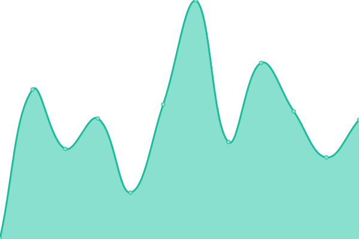
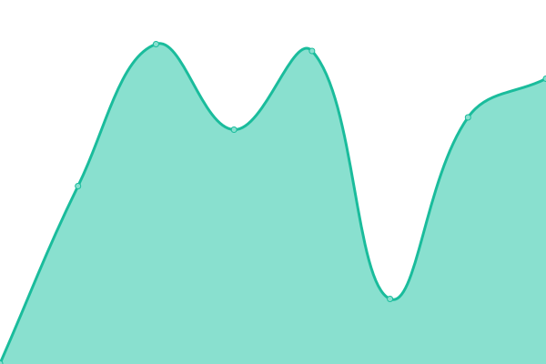
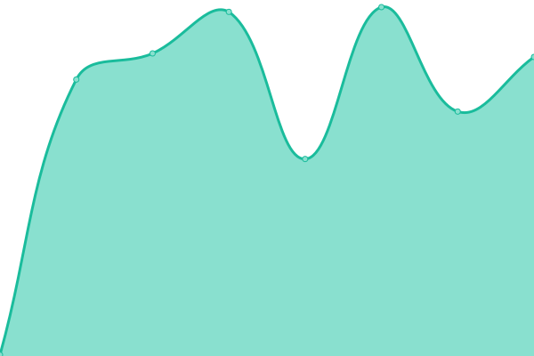
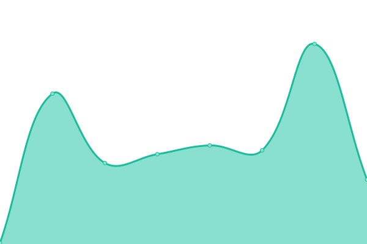
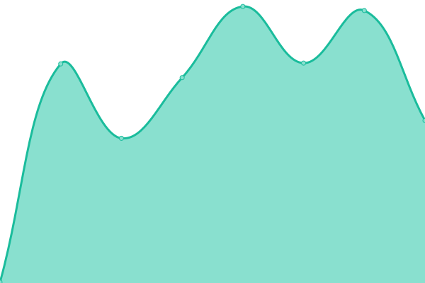
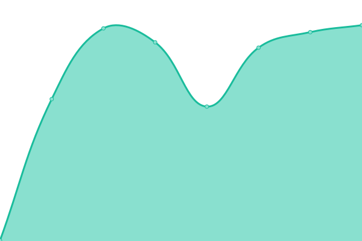

# [📈 Live Status](https://status.detectick.com): <!--live status--> **🟥 Complete outage**

This repository contains the open-source uptime monitor and status page for [Carlos Vouking](https://status.detectick.com), powered by [Upptime](https://github.com/upptime/upptime).

With [Upptime](https://upptime.js.org), you can get your own unlimited and free uptime monitor and status page, powered entirely by a GitHub repository. We use [Issues](https://github.com/carlosvouking/detectick-status/issues) as incident reports, [Actions](https://github.com/carlosvouking/detectick-status/actions) as uptime monitors, and [Pages](https://status.detectick.com) for the status page.

<!--start: status pages-->
<!-- This summary is generated by Upptime (https://github.com/upptime/upptime) -->
<!-- Do not edit this manually, your changes will be overwritten -->
<!-- prettier-ignore -->
| URL | Status | History | Response Time | Uptime |
| --- | ------ | ------- | ------------- | ------ |
|  [Detectick Platform](https://detectick.com) | 🟥 Down | [detectick-platform.yml](https://github.com/carlosvouking/detectick-status/commits/HEAD/history/detectick-platform.yml) | 

 234ms
     
 | 

<a href="https://status.detectick.com/history/detectick-platform">100.00%</a>
    

|  [Detectick API](https://detectick-backend.onrender.com/) | 🟥 Down | [detectick-api.yml](https://github.com/carlosvouking/detectick-status/commits/HEAD/history/detectick-api.yml) | 

 329ms
     
 | 

<a href="https://status.detectick.com/history/detectick-api">100.00%</a>
    

|  [Bitstamp Exchange](https://www.bitstamp.net/api/v2/trading-pairs-info/) | 🟥 Down | [bitstamp-exchange.yml](https://github.com/carlosvouking/detectick-status/commits/HEAD/history/bitstamp-exchange.yml) | 

 457ms
     
 | 

<a href="https://status.detectick.com/history/bitstamp-exchange">100.00%</a>
    

|  [Bitvavo Exchange](https://api.bitvavo.com/v2/time) | 🟥 Down | [bitvavo-exchange.yml](https://github.com/carlosvouking/detectick-status/commits/HEAD/history/bitvavo-exchange.yml) | 

 317ms
     
 | 

<a href="https://status.detectick.com/history/bitvavo-exchange">100.00%</a>
    

|  [Coinbase Exchange](https://api.coinbase.com/v2/time) | 🟥 Down | [coinbase-exchange.yml](https://github.com/carlosvouking/detectick-status/commits/HEAD/history/coinbase-exchange.yml) | 

 163ms
     
 | 

<a href="https://status.detectick.com/history/coinbase-exchange">100.00%</a>
    

|  [Kraken Exchange](https://api.kraken.com/0/public/SystemStatus) | 🟥 Down | [kraken-exchange.yml](https://github.com/carlosvouking/detectick-status/commits/HEAD/history/kraken-exchange.yml) | 

 416ms
     
 | 

<a href="https://status.detectick.com/history/kraken-exchange">100.00%</a>
    

|  [KuCoin Exchange](https://api.kucoin.com/api/v1/timestamp) | 🟥 Down | [ku-coin-exchange.yml](https://github.com/carlosvouking/detectick-status/commits/HEAD/history/ku-coin-exchange.yml) | 

 330ms
     
 | 

<a href="https://status.detectick.com/history/ku-coin-exchange">100.00%</a>
    

|  [OKX Exchange](https://www.okx.com/api/v5/public/time) | 🟥 Down | [okx-exchange.yml](https://github.com/carlosvouking/detectick-status/commits/HEAD/history/okx-exchange.yml) | 

 362ms
     
 | 

<a href="https://status.detectick.com/history/okx-exchange">100.00%</a>
    

<!--end: status pages-->

[**Visit our status website →**](https://status.detectick.com)

## 📄 License

- Powered by: [Upptime](https://github.com/upptime/upptime)
- Code: [MIT](./LICENSE) © [Anand Chowdhary](https://anandchowdhary.com), supported by [Pabio](https://pabio.com)
- Data in the `./history` directory: [Open Database License](https://opendatacommons.org/licenses/odbl/1-0/)
